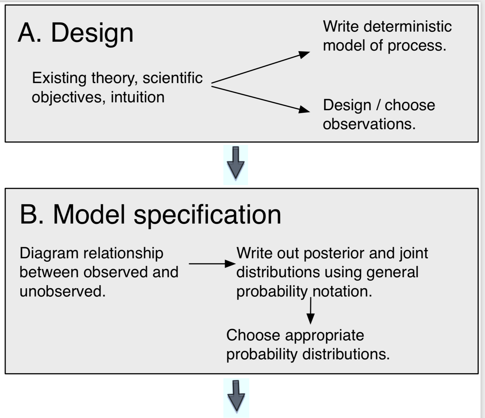
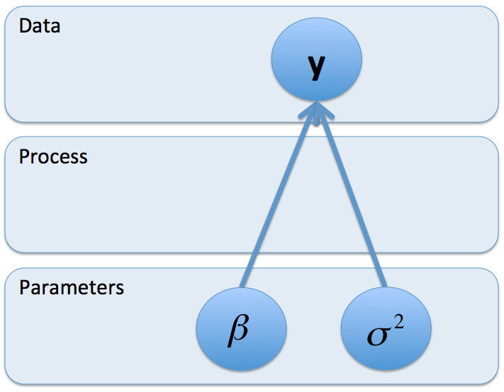
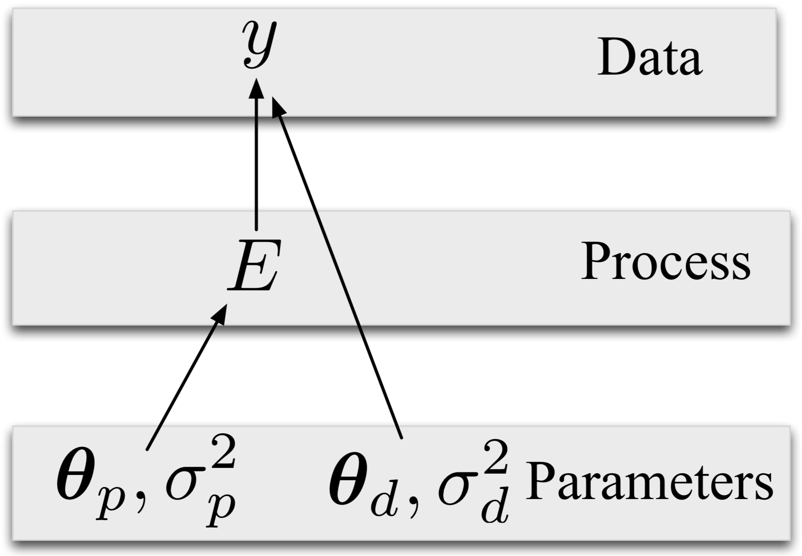
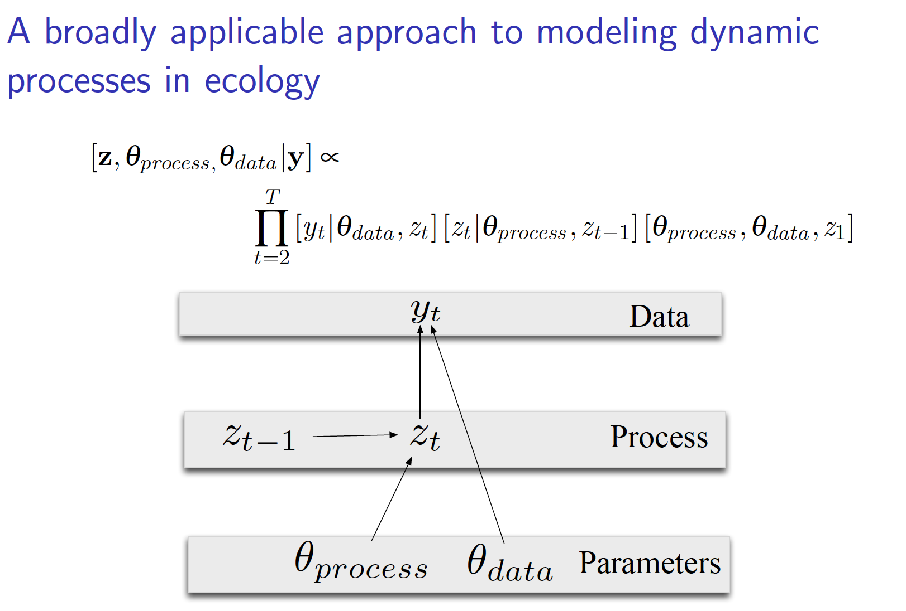

## Process-based model building

(from Hobbs & Hooten 2015)

## Process-based model building

Contrast between empirical model of data and

'Data Generating Process'

Understanding of how observations link to population processes, & how model parameters relate to these relationships

## Simple model for parameters influencing data

(from Hobbs & Hooten 2015)

## Process-based model

(from Hobbs & Hooten 2015)

---

(from Hobbs & Hooten 2015)

## Matrix Population Modeling

Matrix Population Models are convenient way to represent population processes & project population dynamics.  

Can be expanded to many cases.  

Many fisheries stock assessment models can be written in matrix form.  

Caveat is largely linear processes  
- can include nonlinear functions in matrices

## Matrices

Matrix __Order__ is the dimension of the matrix.  
e.g. a matrix order ($m$ x $n$) contains $mn$ elements, has $m$ rows and $n$ columns:  
  
  $$ 
  A_{m,n} = 
  \begin{pmatrix}
a_{1,1} & a_{1,2} & \cdots & a_{1,n} \\
a_{2,1} & a_{2,2} & \cdots & a_{2,n} \\
\vdots  & \vdots  & \ddots & \vdots  \\
a_{m,1} & a_{m,2} & \cdots & a_{m,n} 
\end{pmatrix}
$$
  
---

Matrix form:  
  
  Square matrix: $$\begin{bmatrix}
y_{1,1} & y_{1,2} \\
y_{2,1} & y_{2,2}
\end{bmatrix}$$
  
  Row matrix: $$\begin{bmatrix}
y_{1,1} & y_{1,2} & \cdots & y_{1,n}
\end{bmatrix}$$
  
  Column matrix: $$\begin{bmatrix}
y_{1,1} \\ 
y_{2,1} \\ 
\cdots \\
y_{m,1}
\end{bmatrix}$$
  

  
## Multiplication
  
  scalar multiplication:  
  
  $$A = \alpha 
\begin{bmatrix}
a_{1,1} & a_{1,2} \\ 
a_{2,1} & a_{2,2} \\ 
\end{bmatrix}
=
  \begin{bmatrix}
\alpha a_{1,1} & \alpha a_{1,2} \\ 
\alpha a_{2,1} & \alpha a_{2,2} \\ 
\end{bmatrix}
$$
  So for:  
  $$A =  
  \begin{bmatrix}
4 & -8 & 6 \\ 
2 & -10 & 4 \\ 
\end{bmatrix}
\quad
\frac{1}{2} A =  
  \begin{bmatrix}
2 & -4 & 3 \\ 
1 & -5 & 2 \\ 
\end{bmatrix}
$$

  
## Matrix Multiplication
  
Consider $A$ of order $(m,n)$ and $B$ of order $(n,r)$.

Product $AB = C$ is order $(m,r)$ with elements $c_{i,j} = \displaystyle \sum_{k=1}^n a_{i,k}b_{k,j}$
  
To be able to do matrix multiplication, number of columns in first matrix must equal the number of rows in the second matrix.  

Let

$$A =  
  \begin{bmatrix}
4 & 2 & 6 \\ 
2 & -1 & 4 \\ 
\end{bmatrix}
\quad
B =
  \begin{bmatrix}
2 & -2 \\ 
1 & -5 \\ 
3 & 2 \\
\end{bmatrix}
$$
  
$$ C = AB =
  \begin{bmatrix}
4 \times 2 + 2 \times 1 + 6 \times 3 & 4 \times (-2) + 2 \times (-5) + 6 \times 2 \\ 
2 \times 2 + (-1) \times 1 + 4 \times 3 & 2 \times (-2) + (-1) \times (-5) + 4 \times 2 \\ 
\end{bmatrix}
$$

----

$$ C = AB =
  \begin{bmatrix}
4 \times 2 + 2 \times 1 + 6 \times 3 & 4 \times (-2) + 2 \times (-5) + 6 \times 2 \\ 
2 \times 2 + (-1) \times 1 + 4 \times 3 & 2 \times (-2) + (-1) \times (-5) + 4 \times 2 \\ 
\end{bmatrix}
$$

$$=
  \begin{bmatrix}
8 + 2 + 18 & -8 -10 + 12 \\ 
4 -1 + 12 & -4 + 5 + 8 \\ 
\end{bmatrix}
=
\begin{bmatrix}
28 & -6 \\ 
15 & 9 \\ 
\end{bmatrix}
$$

  
Matrix multiplication is _not_ commutative.  

$BA$ is of order $(3,3)$.  $AB \neq BA$
  

## Matrix multiplication
  
  Other things to know:  
  Matrix multiplication is associative: $(AB)C = A(BC)$  
  Matrix multiplication is distributive: $A(B+C) = AB + AC$   
  Scalar multiplication commutative, associative, & distributive.  

Transpose of a product: $(AB)^{'} = B^{'} A^{'}$
Use exponentiation operator to denote repeated multiplication: $A^{3} = A \cdot A \cdot A$

## Population projection using matrices

Leslie Matrix of population age structure:  

Vector $N_t$ is the numbers at age.
i.e. 
$$N_t = \begin{bmatrix}
n_{0,t} \\
n_{1,t} \\
\cdots \\
n_{J,t}
\end{bmatrix}
$$

Life table matrix consists of the survival from one age to the next on the off-diagonals, and the fecundity of mature individuals on the first row.

$$ X = \begin{bmatrix}
0 & f_1 & f_2 & \cdots & f_{J-1} & f_J \\
S_0 & 0 & 0 & \cdots & 0 & 0 \\
0 & S_1 & 0 & \cdots & 0 & 0 \\
0 & 0 & S_2 & \cdots & 0 & 0 \\
\cdots & \cdots & \cdots & \cdots & \cdots & \cdots \\
0 & 0 & 0 &\cdots & S_{J-1} & S_{J} \\
\end{bmatrix}
$$

---

Population projection  

$$ N_{t+1} = A N_{t} = 
\begin{bmatrix}
n_{1,t} \cdot f_1 +  n_{2,t} \cdot f_2 + \cdots + n_{J,t} \cdot f_J\\
n_{0,t} \cdot S_0 \\
n_{1,t} \cdot S_1 \\
\cdots \\
n_{J-1,t} \cdot S_{J-1} + n_{J,t} \cdot S_{J} \\
\end{bmatrix}$$

## Age-structured Fisheries Model

$$ N_{1,t+1} = R_{t+1} $$
$$ N_{a+1,t+1} = N_{a,t}e^{-(F_{a,t}+M)} $$

$$ N_{A,t+1} = N_{A-1,t}e^{-(F_{A-1,t}+M)} + N_{A,t}e^{-(F_{A,t}+M)}$$

## Matrix form Age-structured Fisheries Model
\begingroup
\fontsize{7}{7}\selectfont
$$\mathbf{N}_{t+1} = 
\begin{bmatrix}
R_{t+1} \\
0 \\
0 \\
0 \\
\cdots \\
0 \\
\end{bmatrix} +
\begin{bmatrix}
0 & 0 & 0 & \cdots & 0 & 0 \\
e^{-(F_{0,t}+M)} & 0 & 0 & \cdots & 0 & 0 \\
0 & e^{-(F_{1,t}+M)} & 0 & \cdots & 0 & 0 \\
0 & 0 & e^{-(F_{2,t}+M)} & \cdots & 0 & 0 \\
\cdots & \cdots & \cdots & \cdots & \cdots & \cdots \\
0 & 0 & 0 &\cdots & e^{-(F_{A-1,t}+M)} & e^{-(F_{A,t}+M)} \\
\end{bmatrix} \begin{bmatrix}
N_{0,t} \\
N_{1,t} \\
N_{2,t} \\
N_{3,t} \\
\cdots \\
N_{A,t} \\
\end{bmatrix}$$
\endgroup

## Building block approach

- multiple matrices applied sequentially  
- each representing a different population process  
- (birth, age increment, survival, movement, etc.)  

(Newman et al. 2015 Chap 2)

## Population Projection Examples
1. Coho salmon (Newman Chapter 2)
2. SEAK Steller sea lions
3. BCB Bowhead whales (HW #1)

## SE AK Steller sea lions

Counts of pups & non-pups over time  

Estimates of fecundity & survival from mark-resight  

Create a stage-structured projection model  

Two life stages, pups (Age 0) and non-pups (Ages 1+)  

## Observation Models

Thus far defined population model projections  
Want to confront population processes with our data  
- e.g. to estimate population parameters  
Additional model for how data relate to population state variables  
_Observation model_  

## e.g. Steller sea lion counts

- Observations are counts of pups and non-pups from aerial photographic surveys  
- Believe counts are proportional to the abundance  
- Some fraction not observed, likely different for pups and non-pups  

$$ \begin{bmatrix}
E[y_{pups, t}] \\
E[y_{np, t}] \\
\end{bmatrix} = \begin{bmatrix}
q_p &  0 \\
0 &  q_{np} \\
\end{bmatrix} \begin{bmatrix}
N_{pups, t} \\
N_{np, t} \\
\end{bmatrix}$$

## Next Week

NO CLASS (GF at ICES conference). 

reading:  
[Quinn 2003, Nat Res Mod](https://doi.org/10.1111/j.1939-7445.2003.tb00119.x)  
[Thorson & Minto 2015, ICES JMS](https://doi.org/10.1093/icesjms/fsu213)  
