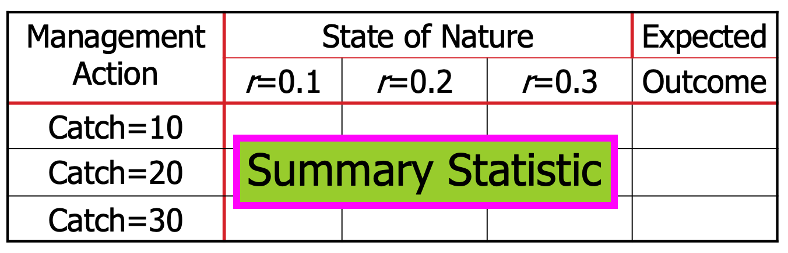
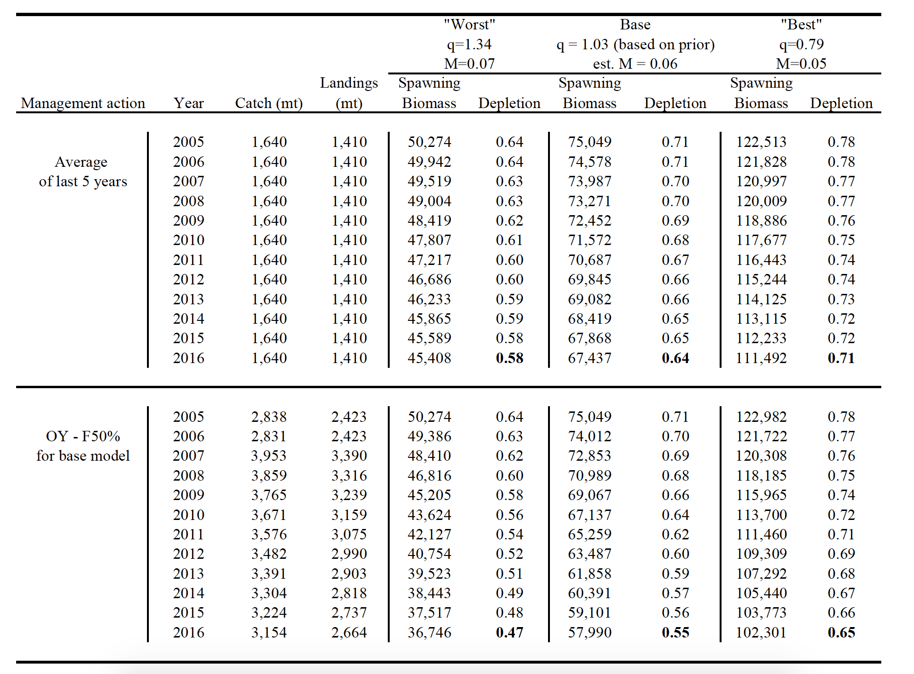
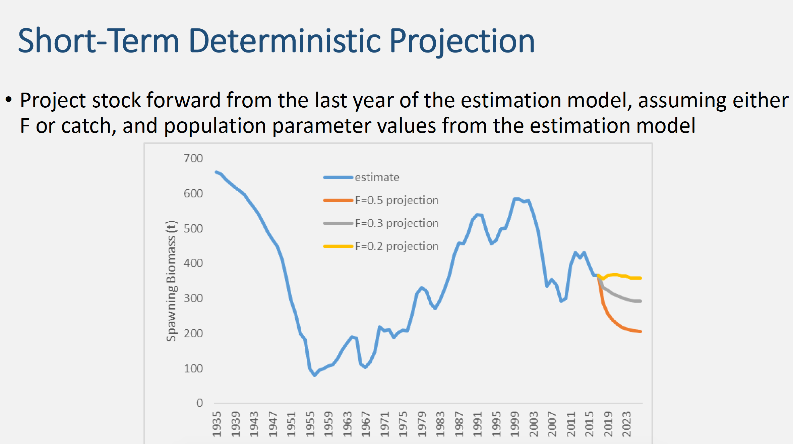
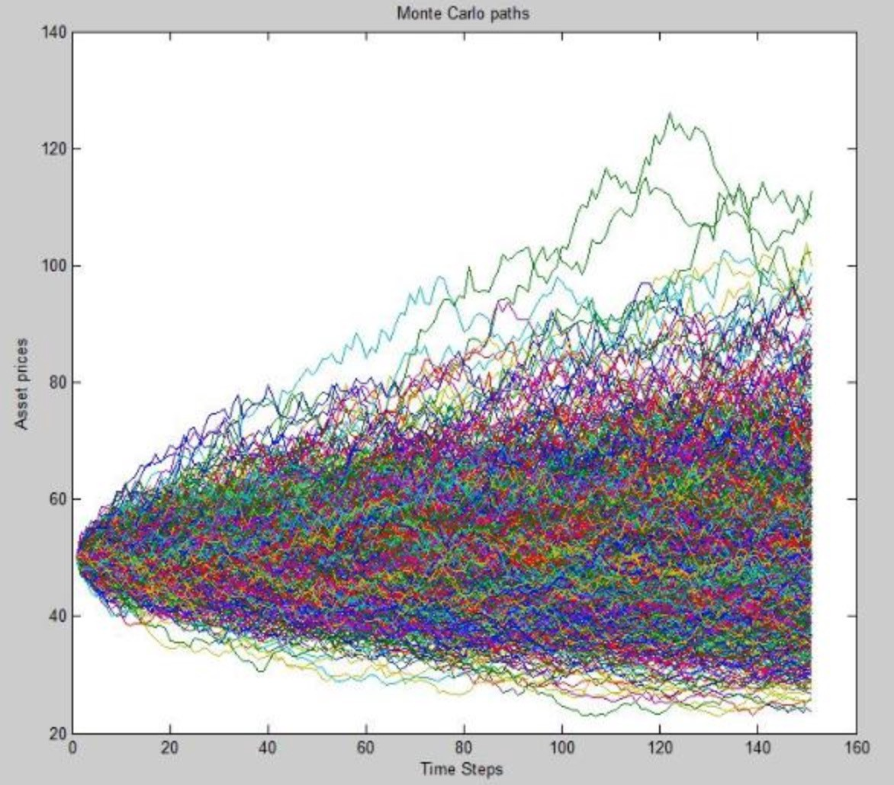
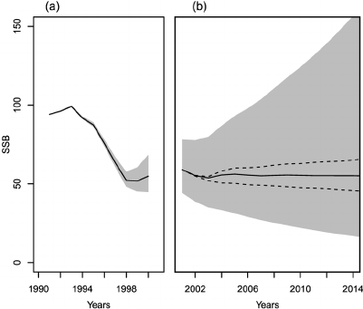
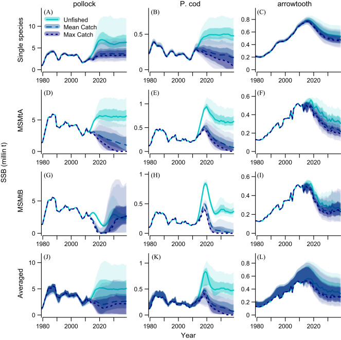

## Decision Analysis

-   We often want to make statements about the consequences of alternative management actions given different states of nature.

-   To compute expected outcomes we need to know the (relative) probability to associate with each state of nature (more in Bayesian lecture), AND have a way of determining the outcome for each management action.

## Decision Tables

-   A common steo after a model is fit and evaluated is to generate advice for management based on the assessment results.

-   A Decision Table shows these results

------------------------------------------------------------------------

(Fay et al. 2005) 

## Stock projections

-   Use the results of the assessment as the basis for the projection, given different assumptions for future conditions

-   e.g. catch, F, recruitment, growth, M, etc.

-   Projections can be deterministic or stochastic, with varying complexity.

------------------------------------------------------------------------

## Implementing deterministic projections

-   Extend (or create new) storage objects for state variables

-   Input the required catch advice (e.g. F or TAC)

-   Loop over the projected years with the calculations for population dynamics

## Stochastic projections

-   Include effects of process error in projections (e.g. recruitment variability)

-   Requires multiple realizations of stock dynamics

-   Often achieved by Monte Carlo simulations.

-   Summarize distribution of outcomes either by quantiles or risk metrics.

------------------------------------------------------------------------

------------------------------------------------------------------------

(Ichinokawa & Okamura 2014)

------------------------------------------------------------------------

(Ianelli et al. 2016)

## Lab exercise 1 - deterministic projection

-   Using the Schaefer biomass dynamics model, conduct a deterministic 30 year projection, with fixed exploitation rates of F=0.1, F=0.2, and F=0.3.

-   Summarize the results in terms of average catch over the projection, and final year biomass relative to BMSY. (hint, for the Schaefer model $BMSY = 0.5K$)

<!-- ## Lab exercise 2 - stochastic projection -->

<!-- -   Using the SCAA model for floundah, conduct 100 30 year projections with a fixed exploitation rate of F=0.3, that include recruitment variability in the forecasts. -->

<!-- (assume that future recruitments are lognormally distributed according to the mean and variance of historical recruits) -->
