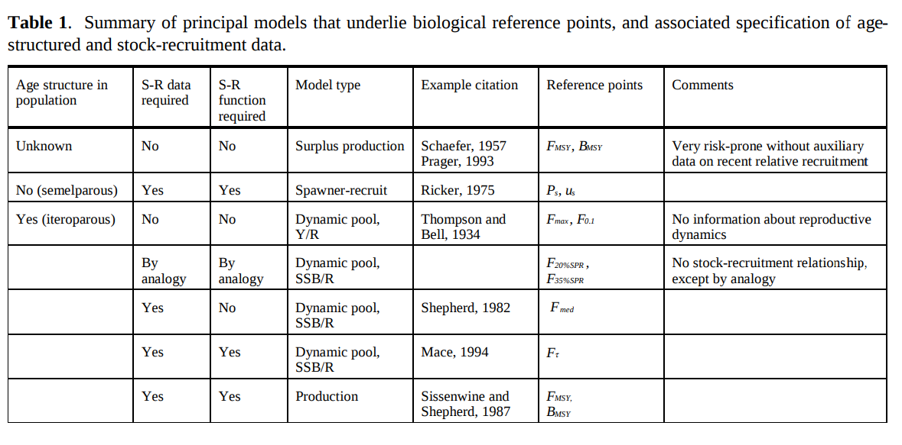
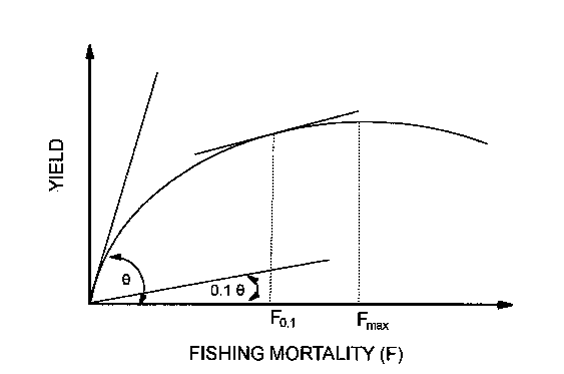
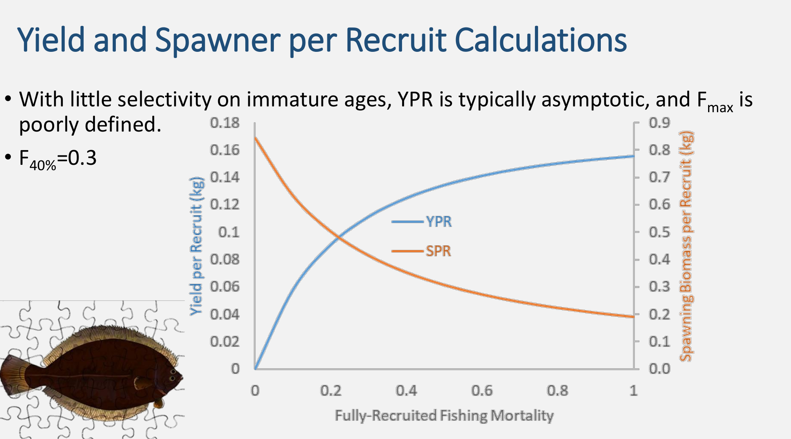
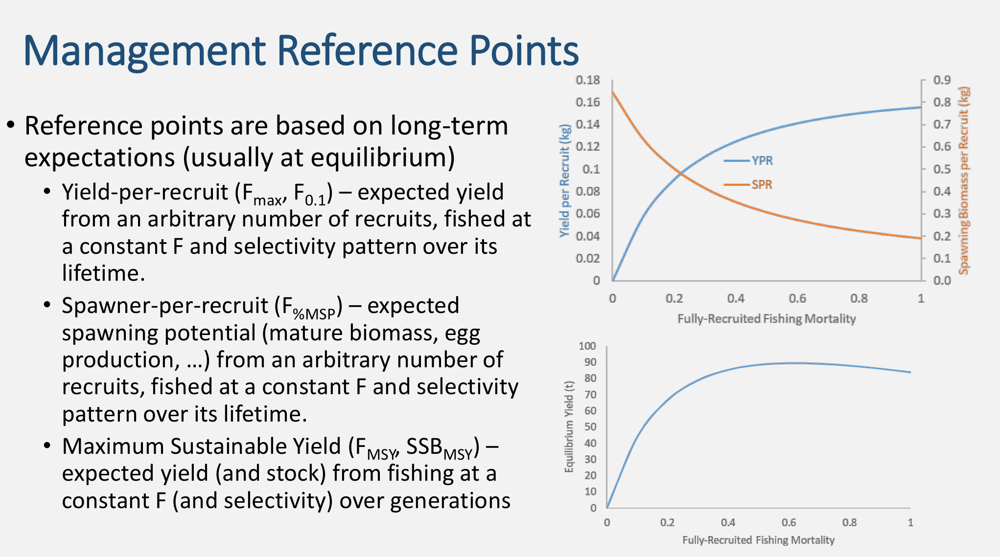
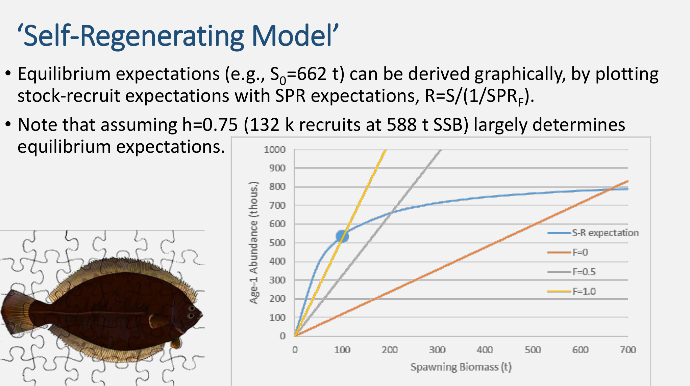
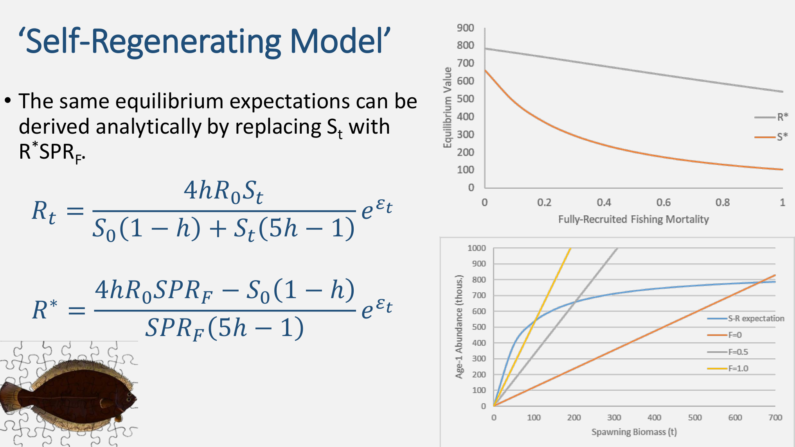

## (Biological) Reference Points (BRP)

-   Generically, a metric of stock status from a biological perspective\
-   Often reflects combination of components of stock dynamics (growth, recruitment, mortality)\
-   3 most common models for BRPs:\

1.  Spawner-Recruit\
2.  Production models\
3.  Dynamic Pool (per-recruit)

## Gabriel & Mace (1994)

## Production models

## Reference points from Yield-per-recruit (YPR)

-   $F_{max}$, fully-recruited $F$ that produces maximum YPR.\
-   $F_{0.1}$, $F$ corresponding to 10% slope of YPR curve at origin.

These BRPs are in context of growth overfishing.

------------------------------------------------------------------------

------------------------------------------------------------------------

## Spawning stock biomass per recruit models

-   Spawning potential\
-   Under no fishing, 100% Spawning potential obtained.\
-   Quantify spawning stock biomass per recruit relative to unfished (Spawning Potential Ratio)\
-   e.g. $F_{35}$, the $F$ that results in a SPR of 35% the unfished level.

<!-- ## Lab exercise: Floundah per-recruit analysis -->

<!-- -   Write functions in R that calculate: -->

<!-- 1.  Yield-Per-Recruit -->

<!-- $$ YPR(F) = \sum_{a} w_as_aFN_{a}(1-exp(-(s_aF+M)))/(s_aF + M)$$ 2. Spawning Biomass Per Recruit -->

<!-- $$ SPBR(F) = \sum_{a} m_aw_aN_{a} $$ -->

<!-- $$ N_a = N_{a-1}exp(-(s_{a-1}F+M)) $$ -->

<!-- -   Use the biology (& selectivity) data for floundah to find the values for: -->

<!-- 1.  $F_{max}$ -->
<!-- 2.  SBPR0 -->
<!-- 3.  SBPR as a function of $F$ -->
<!-- 4.  $F_{40\%}$, i.e. F where $SBPR(F)/SBPR0 = 0.4$ -->

------------------------------------------------------------------------

## Age-structured FMSY

-   Combine SPR with YPR
-   Expected number of recruits from $SBPR(F)$ & knowledge of R/SSB
-   Multiply by YPR(F) to get the yield
-   Growth and recruitment overfishing

------------------------------------------------------------------------

------------------------------------------------------------------------

## In practice FMSY is hard to estimate

-   principally rely on knowing say $h$
-   More often use proxies for FMSY (e.g. $F_{40}$)

## Non-equilibrium

-   These approaches are all equilibrium approaches
-   Can be analytical, numerical, or projection-based
-   Do not reflect process error variance
-   Stochastic estimators for FMSY etc. also common
-   Rely on projections, given assumptions about future dynamics
-   e.g. Future recruitment, weight at age, etc.
-   Take some quantile of the distribution over some time-frame
